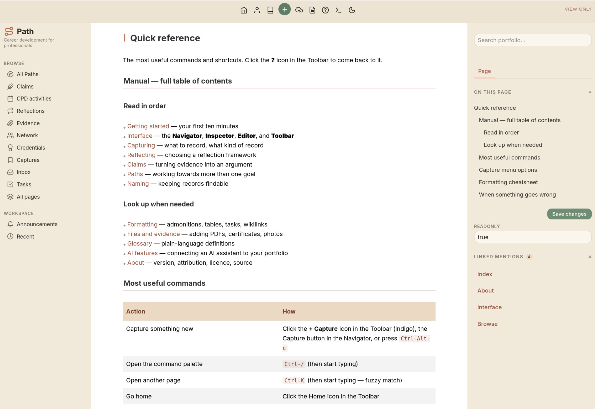
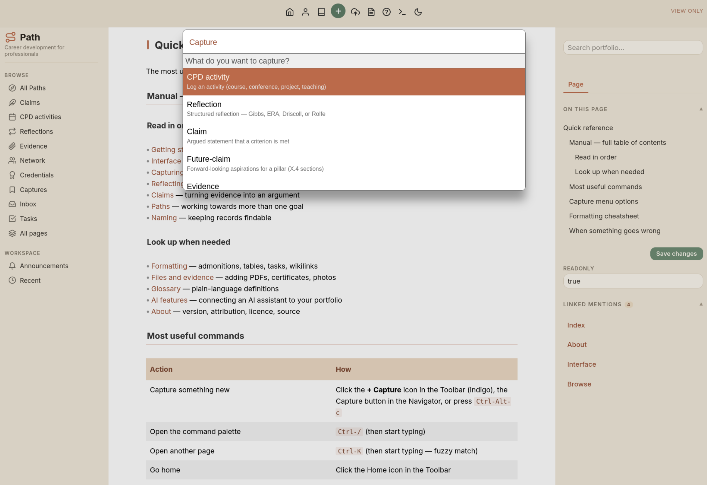
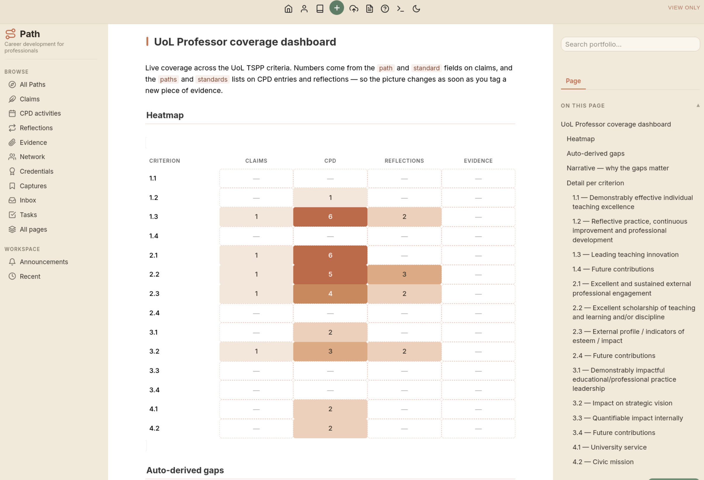
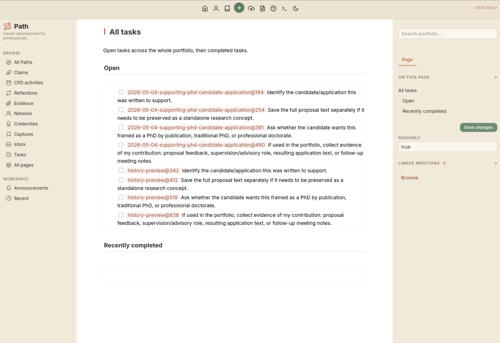
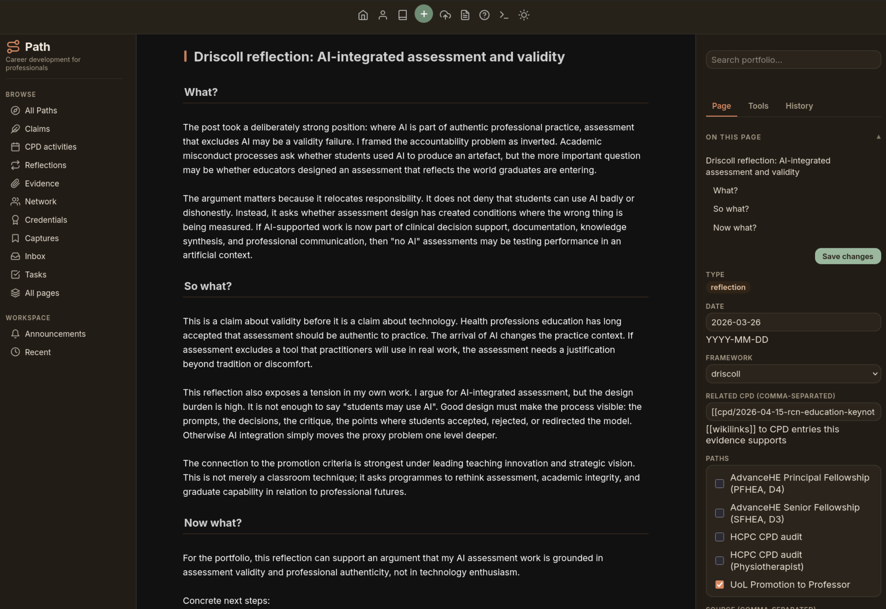

# Path

A local-first portfolio system for regulated professionals, built on top of [SilverBullet](https://silverbullet.md) (a browser-based markdown editor). Path turns SilverBullet into a structured workspace for capturing professional development activities, writing reflections, arguing claims against professional standards, and exporting a submission-ready document. Runs in Docker on your own machine; no accounts, no cloud sync, no subscription.

It's aimed at:

- Allied Health Professionals capturing CPD activity for HCPC recognition
- Academics and educators applying for AdvanceHE Fellowship (currently, only Senior or Principal frameworks available)
- Anyone working toward a structured professional recognition that requires evidence, reflection, and argued claims against published criteria

---

## ⚠️ Heads up

I'm not a developer. I'm an academic working in health professions education who built this because nothing else fit how I wanted to work, and I'm sharing it in case someone else finds it useful. A few things that follow from that:

- **It is not a product.** It is a personal project, made public.
- **There is no support.** I cannot answer "why does this not work on my machine" with any authority; I will probably just shrug and ask Claude.
- **There is no roadmap.** Things change when I'm working on my own portfolio and notice they're annoying.
- **There may be bugs I haven't seen.** I use exactly one configuration; yours will inevitably differ.
- **The bus factor is one.** And the one is not a software engineer *(You should be cautious.)*

If you're after something polished, supported, and feature-complete, this isn't it. If you're happy to tinker, explore markdown, and accept that the maintainer is figuring it out alongside you, you're in the right place.

---

## Some context

Two terms appear all over Path; here's what they mean.

**A Path** is a goal you're working towards: a promotion, a fellowship, a professional registration cycle. Each Path is an instance of pursuing recognition under one **framework**. You can have several Paths active at once — for example, an AdvanceHE Principal Fellowship alongside an institutional promotion application — and the same activity can count towards more than one of them.

**A framework** is the externally-defined set of standards a Path is judged against. The HCPC publishes five CPD standards; AdvanceHE publishes four descriptors with criteria; universities publish their promotion criteria. Path doesn't author these — it currently ships a small registry of professional development frameworks encoded as YAML and markdown templates, and you install whichever ones apply to you. If there's more interest in this project, it's trivial to add more.

Everything else in Path — activities, reflections, claims, evidence — is connected to one or more Paths and tagged against the criteria of those Paths' frameworks.

---

## Features

### Page types

Every piece of content is a structured markdown page with YAML frontmatter (you can think of YAML as file attributes):

- **Path**: a goal you're working towards. Has a status (active / planned / paused / completed / abandoned), a target date, and a framework.
- **Framework + Criteria**: installed from a registry on GitHub. Currently HCPC CPD, AdvanceHE D4 (Principal Fellow), AdvanceHE D3 (Senior Fellow stub).
- **CPD activity**: a logged activity (course, conference, project, teaching). Tagged with one or more Paths and the criteria it addresses.
- **Reflection**: a structured reflection using Driscoll, ERA, Gibbs, or Rolfe. Linked back to the activity.
- **Claim**: a written argument that one criterion has been met, supported by CPD entries and reflections. Includes a Quantified Impact table for measurable outcomes.
- **Evidence**: a separate page for an artefact (PDF, certificate, feedback letter) when the activity record alone doesn't capture it.
- **Credential**: verifiable records of awards, typically cryptographically validated by an external provider or institution.
- **Contact**: a network of contacts who can help support your professional development.
- **Task**: a checkbox item scoped to a Path, surfaced on the dashboard and the Path landing page.
- **Personal statement**: narrative introduction for a Path; embedded into the export.

---

### Editor surface

Path is a SilverBullet plug, not a fork. The editor is SilverBullet — wikilinks, transclusion, markdown. Path adds:

- A **Toolbar** at the top for app-level actions: a distinctive **Capture** button (the primary creation action), **Sync to cloud**, **Export to Word**, **Manual** (`?`), and the light/dark theme toggle. Each is one click, no menu diving.
- A branded left-hand **Navigator** with browse links per page type, an **Announcements** feed (unread badge), and a **Recent** list of edited pages.
- A right-hand **Inspector** with three tabs:
  - **Page** — pinned full-text search, table of contents, editable YAML attributes (dropdowns for enums, multi-select checkboxes for `paths` and `standards`), and Linked Mentions.
  - **Tools** — Check grammar & style, Check broken links, Delete this page. Editable pages only.
  - **History** — per-page version timeline with one-click preview and restore (see Time Machine below).
- A "View only" badge on system pages so you don't accidentally edit the dashboard. Readonly pages hide the Tools and History tabs.
- A **Setup** page that walks you through onboarding and auto-hides from the Navigator once you have a profile, an installed framework, and an active Path.
- Light/dark themes that persist. **Focus mode** (`Ctrl-Alt-z`) hides both side panels for distraction-free editing.

---

### Screenshots

A few screenshots to give you a sense of what it looks like.

_The interface: a branded Navigator on the left, the Toolbar across the top, and the tabbed Inspector on the right with pinned full-text search and linked mentions._
<br />

_A single Capture action opens a picker that routes to the right template — CPD activity, reflection, claim, future-claim, evidence, and more._
<br />

_Automated heatmap showing coverage of your content against the framework's criteria, with an auto-derived gap list below._
<br />

_The task dashboard aggregates open tasks from across your portfolio into one place._
<br />

_Dark mode. The Inspector's Page tab shows editable attributes — including multi-select checkboxes for the Paths and standards an entry counts towards._
<br />

---

### Workflow

A single **Capture** action — toolbar button or `Ctrl-Alt-c` — opens a picker that routes to the right template. Active Path is detected automatically; with two or more, you're asked which Path the new entry is for. Frameworks then drive the rest — for example, a new claim's `framework` field auto-fills based on the chosen Path, and the Inspector's `standards` field becomes a checkbox list of that framework's criteria rather than free-text.

When a goal is achieved (or abandoned), `Path: Archive this Path` flips its status without removing any links from your historical CPD or claims.

### Dashboards and queries

- A coverage **heatmap** per Path shows claims, CPD, reflections, and evidence per criterion at a glance.
- A **gap list** highlights criteria without a claim, CPD entry, or reflection.
- A **Path activity grid** (current month on the dashboard, full year on each Path).
- An **Active Paths** table summarises every running Path with its framework, criteria-covered ratio, claims-ready count, and target date.
- **Open tasks** roll up across all Paths with a chip showing scope.

Queries use SilverBullet's Lua-based query language and re-evaluate live as you add content.

### Export

Optional Pandoc sidecar runs as a separate Docker container. Compiles a chosen subset of pages — personal statement, claims, supporting evidence — into a Word document ready for editing and submission. For PDF, use your browser's print function. Excluded by default to keep the install small (~150 MB without, ~250 MB with). Start with `docker compose --profile export up -d`. The Toolbar's file icon triggers the export.

---

### Time Machine — version history per page

A background **git-watcher** sidecar takes a snapshot of `space/` every 30 minutes. The Inspector's **History** tab shows the version timeline for the current page: each entry lists which files the snapshot touched. Click the preview icon to see a previous version of the page, then **Restore this version** in the sticky banner to bring it back. Snapshots are stored in a local git repo inside `space/` — nothing leaves your machine.

Runs by default with `docker compose up -d`. To force a snapshot or change the interval, see `git-watcher/main.py` (env var `COMMIT_INTERVAL`).

---

### Cloud backup

Optional **rclone** sidecar syncs `space/` to any cloud target rclone supports (Google Drive, Dropbox, S3, WebDAV, OneDrive, …). One-time configure inside the container, then click the cloud-upload icon in the Toolbar to push your portfolio to your remote. Sync runs in the background; status persists across container restarts.

```bash
docker compose --profile backup up -d
docker compose run --rm rclone-svc rclone config    # one-time
```

Behind the scenes: a `RCLONE_REMOTE` env var picks the remote name (default `gdrive`), and the destination folder is `Path-Portfolio-Backup`.

---

### Writing tools

Two optional sidecars accessible from the Inspector's **Tools** tab:

- **Check grammar & style** — runs the current page through **LanguageTool** (self-hosted, no calls out). Issues are rendered into `_system/last-grammar-check`.
- **Check broken links** — runs the current page through **Lychee**. Broken or unreachable links are rendered into `_system/last-link-check`. Results are debounced for 60 seconds per page so a quick re-run doesn't hammer external hosts.

Start with `docker compose --profile writing up -d`. (LanguageTool ships with the Java runtime, so this profile adds ~1.5 GB.)

---

### Search

Optional **Meilisearch** index of the whole space, plus a `meili-indexer` sidecar that re-indexes pages as you save. The Inspector's pinned search box queries it. Results highlight the matched fragment and route on click.

```bash
docker compose --profile search up -d
```

The Meilisearch master key is read from `.env` (`MEILI_MASTER_KEY`); the plug reads the same value from `space/_system/path-config.md` — keep them in sync.

---

### AI assistant (MCP server)

Optional MCP server runs as a third Docker container and connects your portfolio to an AI client (Claude, Cursor, or any MCP-compatible tool). Once connected, the AI can read your portfolio structure and help you work with it directly.

**What it exposes (read):**

| Tool | What it does |
|---|---|
| `get_portfolio_summary` | Overview of all active Paths, total claims/CPD/reflections |
| `list_active_paths` | Active Paths with framework, status, target date |
| `get_path_coverage` | Criterion-by-criterion coverage — claims, CPD, reflections per standard |
| `get_framework` / `get_criterion` | Framework structure and individual criterion detail |
| `list_claims` / `get_claim` | All claims or a single claim with full narrative |
| `list_cpd` / `get_cpd_entry` | CPD activity log |
| `list_reflections` / `get_reflection` | Reflections with full text |
| `list_evidence` | Evidence pages linked to criteria |
| `get_profile` | Your identity and professional context |
| `get_user_context` | Writing voice and style preferences for drafting |
| `search_portfolio` | Full-text search across all portfolio pages |
| `scan_inbox` | Unprocessed captures waiting for review |

**What it enables (write — all writes go to Inbox for review before saving):**

| Tool | What it does |
|---|---|
| `create_capture` | Draft a quick capture from a document or pasted text |
| `create_cpd_entry` | Draft a CPD activity record |
| `update_claim_status` | Move a claim from draft to ready |

**What this makes possible:**

- Ask "what's the biggest gap in my portfolio?" and get a criterion-by-criterion answer
- Paste in a conference programme or meeting notes and ask "does anything here count as CPD?"
- Ask the AI to draft a reflection or claim narrative in your own voice, grounded in your existing records
- Get a gap analysis before a submission deadline without opening the portfolio at all

**Starting the MCP server:**

```bash
docker compose --profile ai up -d
```

The server runs on `http://localhost:3001/sse`. Configure your AI client to connect there. For Claude Code, add to `~/.claude.json`:

```json
"path": {
  "type": "sse",
  "url": "http://localhost:3001/sse"
}
```

The server is read-only by default for browsing. Write tools create drafts in your Inbox — nothing is committed to your portfolio without your review.

---

### Data ownership

Everything lives in `space/` as plain markdown. If you stop using Path, the files are still readable in any text editor. Nothing is sent off your machine.

---

## Prerequisites

- [Docker](https://www.docker.com/)
- A modern browser

No Node, Python, or LaTeX installation needed — Docker handles all of it.

---

## Setup

### Setup scripts (recommended for most users)

There are setup scripts for Linux and Windows that handle Docker installation, image download, and first run in a single step.

> **These scripts are early and largely untested outside of my own machine.** They work on my Linux setup. The Windows script is written to spec but has not been run on a real Windows machine. You will likely run into something — a permission prompt, an unexpected Docker state, a WSL2 step, a package that behaves differently on your OS. If something goes wrong, the manual steps below will get you there.

**Linux:**

```bash
bash <(curl -fsSL https://raw.githubusercontent.com/michael-rowe/path/main/setup.sh)
```

Or download `setup.sh` from this repo and run `bash setup.sh`.

**Windows:**

Download `setup.bat` from this repo and double-click it. It will open a PowerShell window and walk you through the process.

The scripts offer three installation sizes:

| Tier | What's included | Installed size |
|---|---|---|
| Basic | Editor, version history, Word export | ~1.9 GB |
| Standard | + full-text search | ~2.3 GB |
| Full | + writing tools, grammar, link checker, cloud backup, AI client | ~4.0 GB |

---

### Manual setup

For those who want direct control, or if the script doesn't work:

```bash
git clone https://github.com/michael-rowe/path.git
cd path
cp .env.example .env
# Edit .env: SB_USER=admin:your-password
```

Then bring up the services you want:

```bash
docker compose up -d                          # core: SilverBullet + Time Machine
docker compose --profile export up -d         # + Word export
docker compose --profile search up -d         # + full-text search
docker compose --profile writing up -d        # + grammar & link check
docker compose --profile backup up -d         # + cloud backup (run rclone config first)
docker compose --profile ai up -d             # + MCP server for AI clients
```

Profiles compose: `docker compose --profile export --profile search --profile writing up -d`.

Open http://localhost:3000, log in with whatever you put in `.env`, and follow the **Setup** page. It walks you through filling in your profile, installing a framework, and creating your first activity. The Setup entry disappears from the Navigator once those three steps are done.

---

## Updating

The app provides notifications when updates are available, with instructions on how to follow through.

```bash
git pull
docker compose pull
docker compose up -d
```

Your content (`space/claims/`, `space/cpd/`, etc.) is gitignored so updates don't touch it. If you're running optional profiles, pass the same ones you used at install:

```bash
COMPOSE_PROFILES=export,search docker compose up -d
```

---

## Backing up

```bash
cp -r space/ /somewhere/safe/
```

That's it — everything is plain markdown plus a few image attachments.

---

## Frameworks

Frameworks are installed at runtime from a separate registry: [github.com/michael-rowe/path-frameworks](https://github.com/michael-rowe/path-frameworks). Inside Path, run **Path: Add framework** from the command palette.

To contribute a new framework or update an existing one, open an issue or PR on the registry repo. A framework bundle is just a YAML file describing the criteria, plus a small set of templates and a Path scaffold. Or, let me know what framework you're working against and I'll create a draft that you can work with.

---

## Manual

The full manual is inside Path itself. Open the command palette and navigate to `manual/index`, or click the book icon in the toolbar. It's plain markdown, so you can also read it on disk if Docker isn't running.

---

## Contributing

Contributions would genuinely be cool. Fair warning though: I've never reviewed a pull request in my life, and the words "rebase" and "squash" mean roughly nothing to me. I'll figure it out — slowly, badly, possibly with help — but expect turnaround to be measured in days, not minutes.

Issues are easier and very welcome. Bug reports with reproduction steps and your SilverBullet / Docker versions are particularly useful (but bear in mind, I'm not a developer). Feature requests are also welcome but unlikely to be acted on quickly unless they overlap with what I happen to need next.

---

## Licence

[PolyForm Noncommercial 1.0.0](LICENSE).

In practical terms: individuals, charities, educational institutions, public research organisations, government bodies, and similar noncommercial users can use, copy, modify, and distribute Path freely. Commercial use — selling it, offering it as a paid service, or building a commercial product on top of it — is not permitted under this licence. If you need a commercial licence, get in touch.

Why this licence rather than MIT? Path is being shared as scholarly infrastructure for health professions education, not as a product someone else can enclose. PolyForm Noncommercial keeps it free for the people it's meant for (clinicians, academics, students, institutions running internal CPD) while preventing it being taken closed-source and sold back to them.

There's no warranty, and I'm not liable if anything breaks for you. SilverBullet, Pandoc, and the other open-source projects Path builds on keep their own licences (MIT, GPL, etc.) — this licence applies to the Path-specific code and content in this repository.
